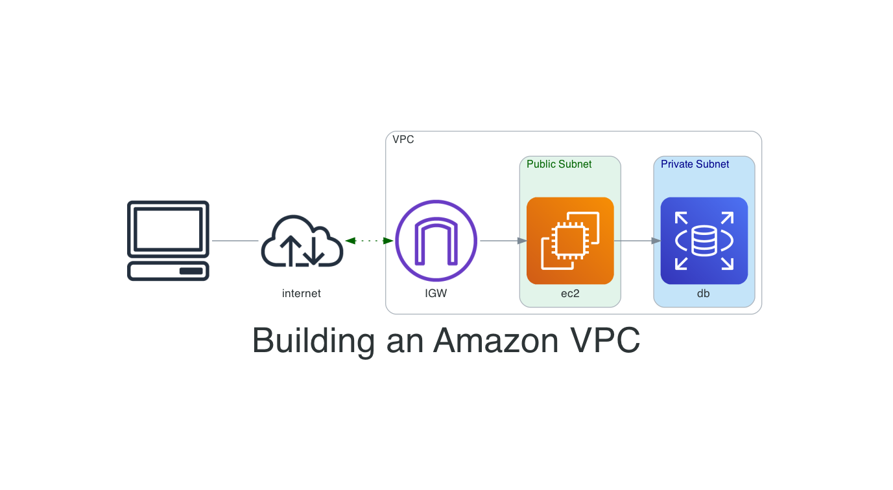

# AWS Network Diagram Sample

This repo shows how to use the [Python Diagrams Library](https://diagrams.mingrammer.com/) to create diagrams of AWS network Architecture. For more information check out my Medium post:  


 
___
## Install project requirements

Once you have your virtual environment setup and activated you will need to install your python packages if needed. One way to do this is by doing `pip install <python package>` another way is by using the
example listed below. It will installed the required libraries for this specific package.

```bash
python -m pip install -r requirements.txt
```

___
### About me

Introverted Network Automation Engineer that is changing lives as a Developer Advocate for Cisco DevNet. Pythons scripts are delicious. Especially at 2am on a Saturday night.

My hangouts:

- [LinkedIn](https://www.linkedin.com/in/duanlightfoot/)

- [Twitter](https://twitter.com/labeveryday)